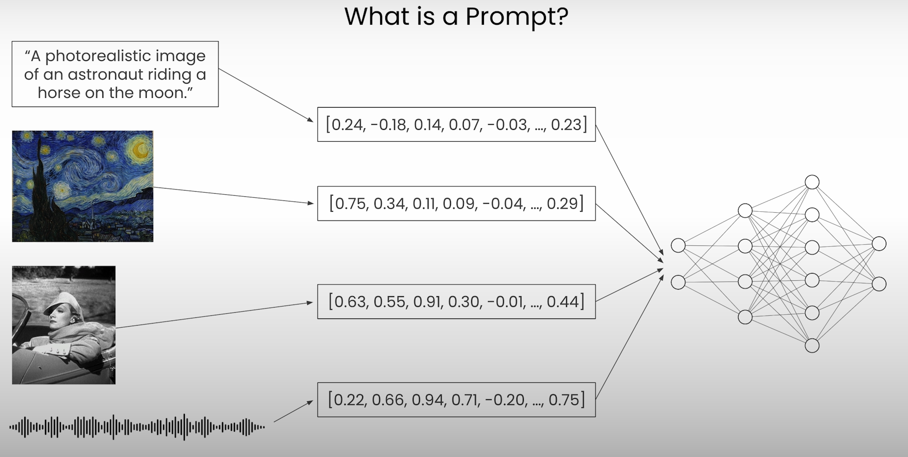
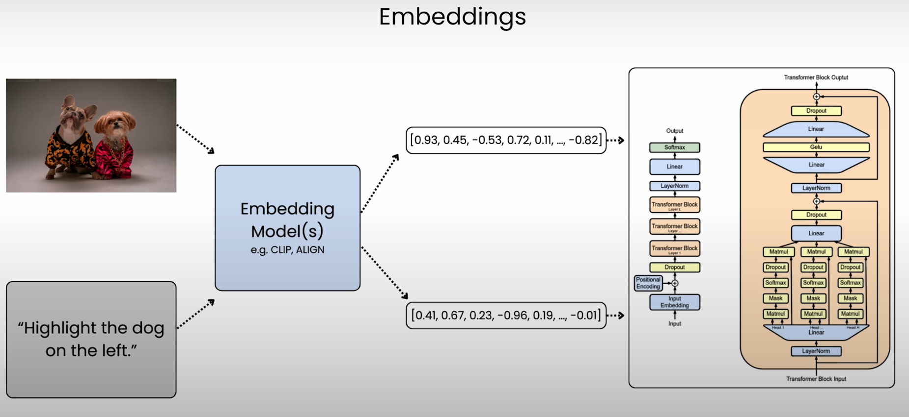
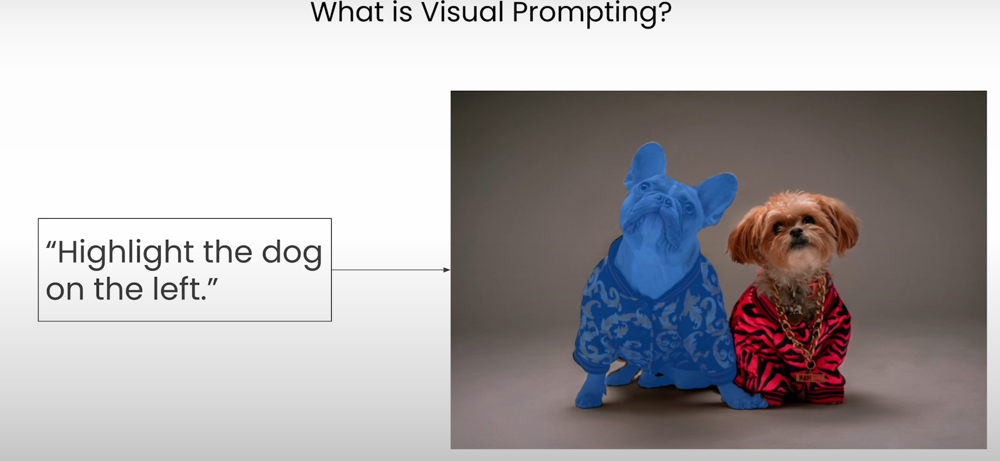
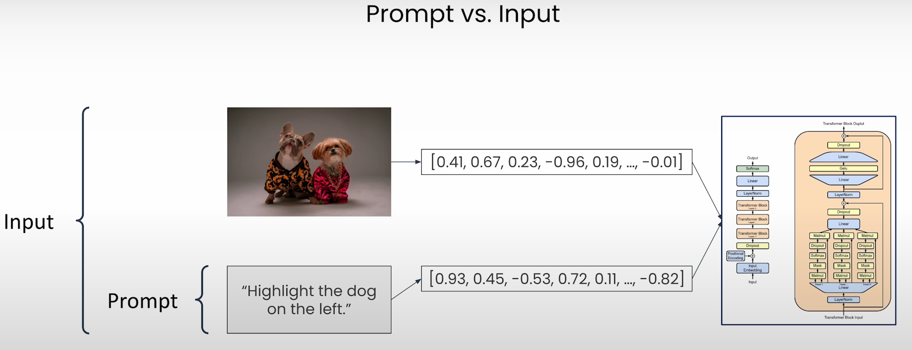
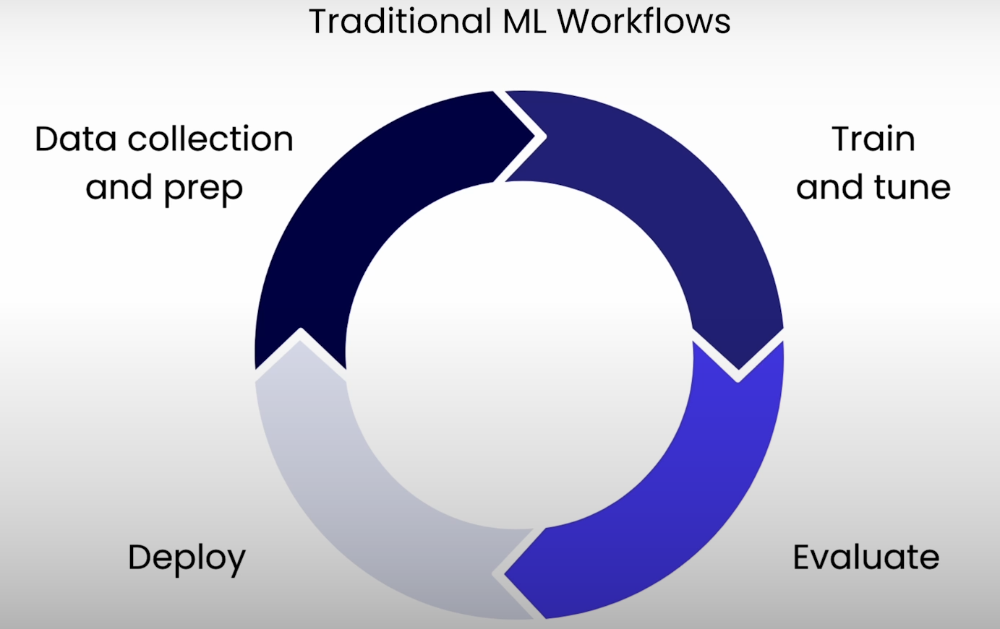
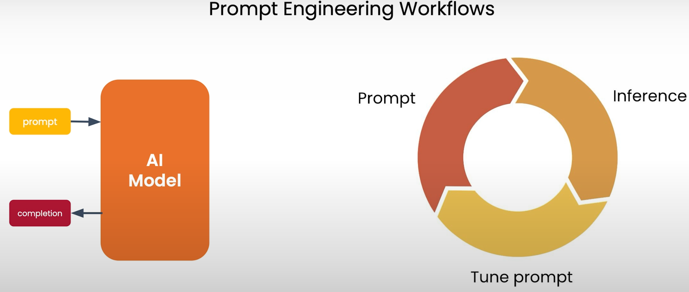
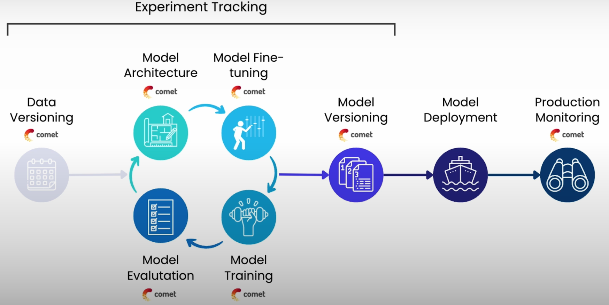
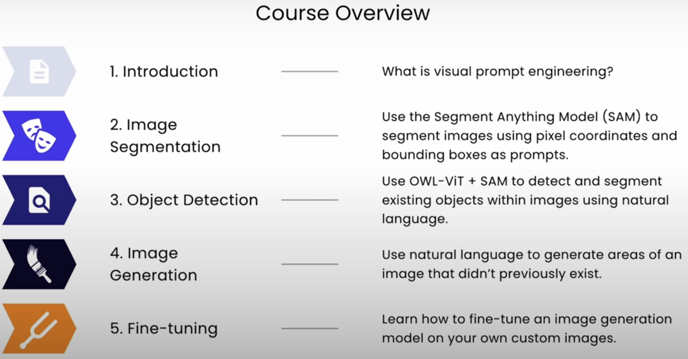

# Lesson1: Overview

2023 saw the rise of a new machine learning workflow: `Prompt Engineering`.

In this lesson, we'll cover some basic [prompt engineering concepts](https://github.com/afondiel/ChatGPT-Prompt-Engineering-DeepLearningAI) that will serve as foundational knowledge for the following code walkthroughs.

Let's start with the basics!

## What is a prompt?

<!--  -->


(Source [Link](https://learn.deeplearning.ai/courses/prompt-engineering-for-vision-models/lesson/2/overview/))

You may be most familiar with text prompts for LLMs, but prompts aren't just limited to text or to just large language models.

In fact, theoretically, any kind of data can be a prompt, including text and images, but also audio and video.

> **A prompt is simply an input that guides the distribution of the output**

And visual inputs do just that for diffusion models.

So the text here: 

```
a photorealistic image of an astronaut riding a horse on the moon
```

It's a prompt, as you may be familiar with if you've interacted with large language models (LLMs).

An image can also be a prompt since, as we've just mentioned, a prompt is just an input that guides the sampling distribution of the output.

You might instruct a `vision model` to recreate an image in `the style of the Van Gogh painting` we have here, for example.

> [!NOTE] 
> For a more detailed breakdown of how diffusion models use sampling distributions, check out [Sharon Zhou](https://learn.deeplearning.ai/courses/diffusion-models/lesson/1/introduction) fantastic short course on how diffusion models work.

For the same reason as an **image can be a prompt**. So too can a **video**, since a video at the end of the day is just a series of images.

Finally, an **audio file could also be a prompt**. The audio clip of a person saying: 

```
"a photo realistic image of an astronaut riding a horse on the moon"
```
it could be used as a prompt to an `audio model`.

Ultimately, each of these data types will be converted into a `numerical representation` before being fed to the machine learning model. 

And often these inputs will be further processed into [embeddings](https://en.wikipedia.org/wiki/Word_embedding) to save on space and compute. 

> **`Embedding` is just a relatively low dimensional space into which you can translate high dimensional vectors.**



(Source [Link](https://learn.deeplearning.ai/courses/prompt-engineering-for-vision-models/lesson/2/overview/))

Some popular embedding techniques for text and images include [CLIP](https://huggingface.co/docs/transformers/model_doc/clip) or [ALIGN](https://huggingface.co/docs/transformers/model_doc/clip) both of which are incorporated into the models you'll use in this course.

> **`Visual prompting` like `language model prompting`, is a method of interacting with a pre-trained model to accomplish a specific task that it might not necessarily have been explicitly trained to do.**



(Source [Link](https://learn.deeplearning.ai/courses/prompt-engineering-for-vision-models/lesson/2/overview/))

This typically involves passing a set of instructions describing what you'd like the model to do, sometimes with some sort of accompanying `image data`. 

As mentioned, these instructions can come in a variety of forms: 
- text
- other images
- pixel coordinates 
- bounding boxes

### Prompt VS Input

Let's clarify the difference between a prompt and an input.



> **A `prompt` is a set of `instructions` describing what tasks the model should perform.**

(Source [Link](https://learn.deeplearning.ai/courses/prompt-engineering-for-vision-models/lesson/2/overview/))

> Therefore, the prompt is a part of the `total input data` that is fed to the model, which may also include additional `context data`.

In this example, the prompt is the instruction to highlight the dog on the left, but the total input is the input image of the dogs combined with the prompt.

> [!IMPORTANT]
> It's also important to note that the input to a model does not necessarily include a prompt.


## Prompt Engineering vs Traditional Machine Learning Workflows

Prompt Engineering workflows are innately different from traditional machine learning workflows, which focus on **training, testing, and iteration**.



(Source [Link](https://learn.deeplearning.ai/courses/prompt-engineering-for-vision-models/lesson/2/overview/))

>[!NOTE]
> In fact, in prompt engineering workflows, you won't be doing any `training` at all.
> Instead, you'll be using a pre-trained model and will focus on engineering the optimal combination of model settings, input data, and prompts in order to get the desired output.



(Source [Link](https://learn.deeplearning.ai/courses/prompt-engineering-for-vision-models/lesson/2/overview/))


> [!WARNING]
> Notice that in this workflow, we never update model weights. We simply change the inputs being passed to the model.


In most of this course, we won't be doing any model training, so we'll want to either use a model that was fine tuned on our specific use case, or a model that generalizes well to tasks and concepts that you might not have seen before.

## Experiment Tracking

We'll take a look at fine-tuning in the last lesson of this course, as well as some of the best practices for tracking and visualizing training runs so that they are easily reproducible.

Whether you're building a traditional machine learning system or prompt engineering, keeping track of all the data model and hyperparameter configurations will help you reproduce results and also iterate faster. This is called `experiment tracking`.



(Source [Link](https://learn.deeplearning.ai/courses/prompt-engineering-for-vision-models/lesson/2/overview/))


You can use [observability tools](https://github.com/awesome-mlops/awesome-ml-monitoring) such as `Comet` to automate the tracking of all these components, for both the model training phase and production monitoring phase of your application lifecycle.

for both the model training phase and production monitoring phase of your application lifecycle.

## Course Plan



(Source [Link](https://learn.deeplearning.ai/courses/prompt-engineering-for-vision-models/lesson/2/overview/))

In this course, you'll be leveraging [Comet](https://www.comet.com/site/computer-vision/) to keep track of your fine-tuning data using its data set versioning functionality, as well as its visualization capabilities that will help you review the images that you will be generating.

All the code you will run will also be saved and Comet, ensuring that you can come back to each image and know exactly how it was generated.

you'll explore several different ways to prompt large vision models (LVMs) by creating a text, image inpainting pipeline that you'll track and Comet.

First, you'll use Meta's Segment Anything Model (SAM) to create and select segmentation masks for regions of your images.

You'll then explore how to use pixel coordinates, bounding boxes, and even text to instruct SAM on which masks to generate.

Next, you'll perform inpainting with AI. Inpainting, in an non-Al context, is the method of restoring artwork that has faded or been damaged in some parts.

In the context of AI, inpainting refers to the action of editing parts of an image using a series of vision models to first identify to create and select segmentation masks for regions of your images.

> In the context of AI, inpainting refers to the action of editing parts of an image using a series of vision models to first identify region of the image, to edit, and then generate its replacement.

The image generation model you'll be using is [Stable Diffusion](https://huggingface.co/spaces/stabilityai/stable-diffusion) from [Stability AI](stability.ai).

You'll get to see for yourself how slightly different versions of a prompt can lead to a very different outcome.

You'll also track all of these inputs and outputs with Comet, so that you can examine all of your results side by side and select the best generated image.

Having an [experimentation tracking tool](https://www.comet.com/site/computer-vision/) as your assistant, will enable you and anyone else you collaborated with to walk through the exact same steps to create the exact same images in the future.

> **Prompt engineering is often the cheapest and quickest way to optimize your outputs for a large language or vision model**.

But sometimes you may find that prompt engineering just isn't enough to perform your specific task, at which time fine-tuning the model to perform that specific action may get better results.

So, you'll explore how to **fine-tune stable diffusion** via [Google's Dreambooth](https://huggingface.co/docs/diffusers/training/dreambooth) training technique on your own custom image dataset.

By the end of this course, our goals for you are: that you'll understand what visual prompting is, that you'll be able to prompt larger vision models (LVMs) with pixel coordinates, bounding boxes, wrong beddings, and natural language.

You'll be able to fine-tune a diffusion model with a few images, and you'll know how to track, organize, and visualize all of your inputs and outputs so that you're able to reproduce your results later on.

In the next lesson, you'll prompt the [Segment Anything Model (SAM)](https://segment-anything.com/) to generate masks using both pixel coordinates and bounding boxes.

Let's go on to the next lesson.

## References

Main Course:
- https://learn.deeplearning.ai/courses/prompt-engineering-for-vision-models/lesson/2/overview

Docs:

- [CLIP HF](https://huggingface.co/docs/transformers/model_doc/clip)
  - [paper](https://arxiv.org/pdf/2102.05918)
- [ALIGN HF](https://huggingface.co/docs/transformers/model_doc/align)
  - [paper](https://arxiv.org/pdf/2103.00020)
  - EfficientNet (visual features) + BERT (text features)

