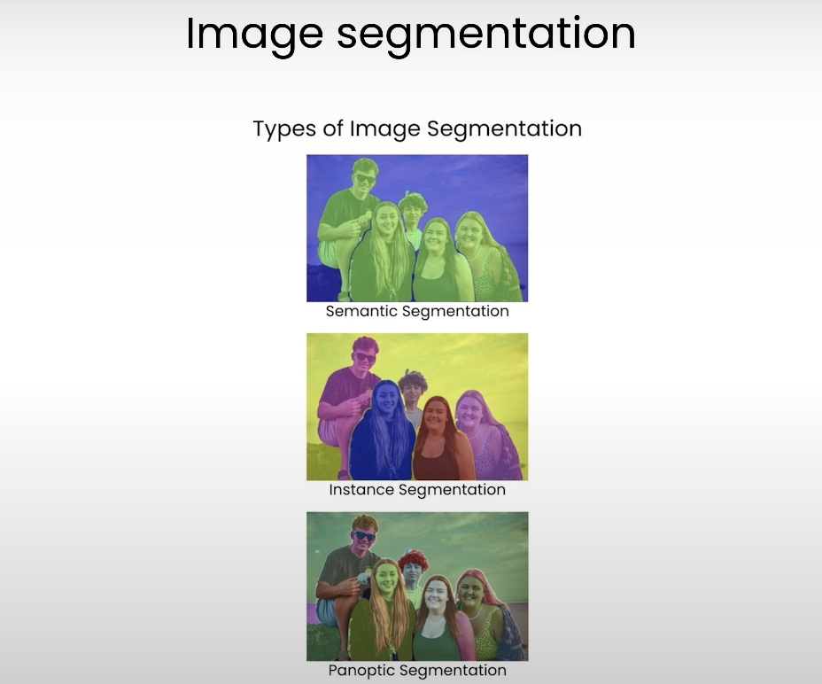
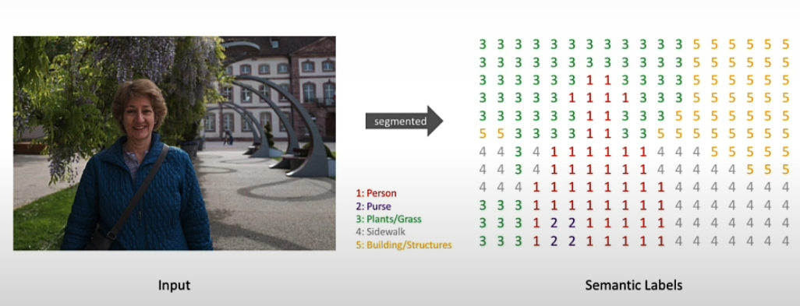
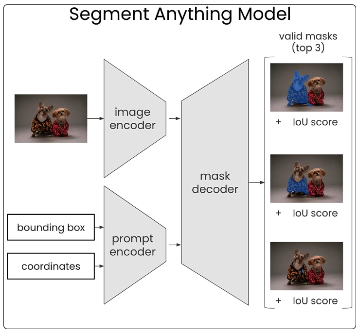
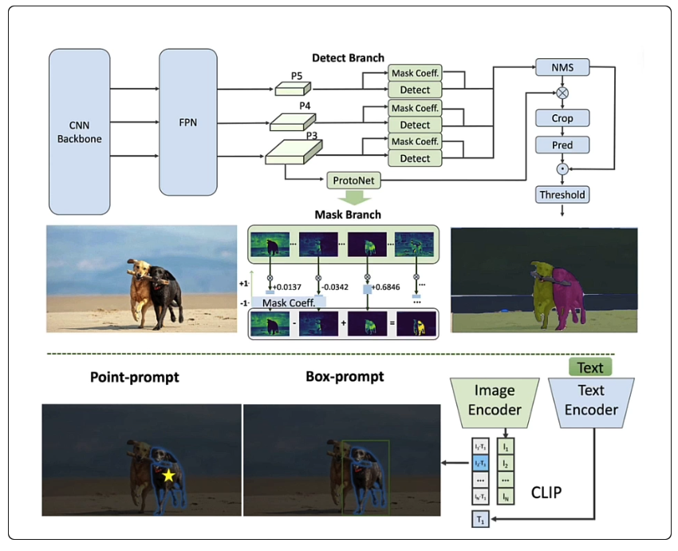

# Lesson2: Image Segmentation using SAM (Segment Anything Model)

## Overview

[The Segment Anything Model (SAM)](https://segment-anything.com/), is a universal image segmentation model capable of addressing a wide range of downstream segmentation tasks through prompt engineering.

In this lesson, you'll prompt SAM with **positive and negative prompt coordinates**, as well as **bounding boxes** to create `segmentation masks`.

Later in the course, you'll use these masks as inputs to other vision models for image editing. Let's jump in.

Let's take a look at a few different methods of visually prompting the Segment Anything Model, SAM, for Meta AI.

## What is image segmentation?

> Image segmentation is a computer vision technique that partitions a digital image into discrete groups of pixels or image segments.

`Image segmentation` is typically used to locate objects and boundaries in images, and is commonly used in object detection, 3D reconstruction, and image editing workflows.

`Image segmentation` is the proces
s of assigning a label to every pixel in an image such that pixels with the same label share certain characteristics.

Let's take a look at a few different methods of visually prompting the Segment Anything Model (SAM): 
- the Segment Anything Model (SAM) 
- faster version of the Segment Anything Model (FastSAM) 
- prompting with a set of pixel coordinates
- prompting with multiple sets of coordinates
- prompting with bounding boxes
- using a positive and negative prompts

The original Segment Anything Model is a milestone in computer vision that has become a foundational step for many high-level downstream tasks like image segmentation, image captioning, and image editing. 

But its `high computational costs` sometimes prevent it from wider applications in industry scenarios like those in `edge devices`.

SAM's computational costs mainly come from its `transformer architecture`.

As you can see in the image, SAM accepts either: 
- **bounding box coordinates**
- **single pixel coordinates** 
- **input image** 

Each of these inputs is encoded by an `image encoder` and a `prompt encoder`, respectively.

They are then fed into the `masked decoder`, and SAM outputs the `top three valid masks` for that point or bounding box.

Fast SAM is a `CNN-based` Segment Anything Model trained using only `2% of the original dataset (i.e: 220k images from 11 million images)` published by the SAM authors and achieves comparable performance on `32x32 images`, but at `50x higher the runtime speed`.

> Prompting Fast SAM also differs slightly from prompting the original SAM, in that it automatically **detects all masks** in an image above a configurable confidence threshold, and then filters all the generated masks based on the prompts provided by the user.

## Lab: script along with the notebook 👉 

We've already installed the necessary package into this environment, but if you're following along in your own environment, you'll need to pip install a few packages here.

First, we'll open the example image we'll be using throughout this lesson and take a peek at it. 

Great! Before you create your first mask, you'll need to resize the image so that it's 1024 pixels wide as this is what the SAM model expects.

For this, we've written a custom function which you can import from the utils file. You can see that the image looks exactly the same as before, only this time it's been resized.

For this lesson, we'll only be using our CPU, but if you're following along at home and have access to GPU, you're welcome to connect to that as well.

As we already mentioned, the Segment Anything Model requires significant memory resources to run.

So, for this code walkthrough, we'll be using the smaller version of Segment Anything called Fast SAM. Fast SAM is available through Ultra Linux and we can download it into our environment like this.

SAM can be used to create masks based on either a single set of pixel coordinates, a set of coordinates, or bounding boxes. You will start by using the SAM model to isolate the dog on the left.

To do this, you'll define a point on the image that the model will use as a starting point for the segmentation.

Let's start by importing a utility function we have created for you that we'll use to check where the point you specify is located on the image.

Since it's possible to specify multiple points when prompting the SAM model, we will define the input points using a nested list.

The first coordinate refers to the x-axis, and the second coordinate refers to the y-axis. We can also define the input labels as either positive or negative.

A positive point is included in the mask, and a negative point is excluded from the mask. For our first example, let's use a positive point. 

Using our custom function above, we can visualize where that point is on the image.

Perfect! Now that you have defined the point prompt and resized your input image, let's pass this information to the model so that it can generate your first mask.

The first step in the process is to run the model on the image. 

This will segment the entire image into multiple masks that we can then filter down using our point prompt.

You will now filter the masks that you generated in the previous step based on the point we defined above.

Now that you have generated the masks, you can visualize them on the original image to make sure that they have been generated correctly.

Great. You don't have to select just one point though, you can also specify two points if you wanted to get a larger mask.

Let's try creating a mask for both of the dogs. This would be referred to as a semantic mask. As previously, you'll first specify two points as prompts to the SAM model.

And specify each as a positive prompt. Again, let's visualize these points on the image to make sure they're in the right place. 

Perfect. You can then run the same process as previously done to obtain the mask. 

Again, reformat the mask that was generated before based on the points defined for both dogs. 

Now that the masks are generated, you can visualize them on the original image to make sure that they were generated correctly. 

So far, we've only been using positive prompts, that is, prompts that tell the model what we do want it to segment. 

To specify sub-sections of an object, it may also be helpful to use negative prompts or prompts that tell the model what we do not want it to segment.

This time, let's choose a 2D coordinate on the dog's jacket with a positive label and a 2D coordinate on the dog with a negative label to indicate to the model that we only want to segment the jacket on the dog.

To do this, we'll pass a list of 2D coordinates just like before, but this time we'll specify zero for the negative labels. 

As you can see, the green star indicates a positive prompt and the red star indicates the negative prompt. 

Hopefully, this will indicate to the model that we only want to segment the jacket. You will use the same steps as before to create the mask. Great. 

When using machine learning models, it is common to use bounding boxes. Bounding boxes are rectangles overlaid on the image that are used to highlight an object. 

They're commonly used in object detection workflows. This time, instead of specifying a prompt point, we'll specify a bounding box prompt to highlight the dog on the right. 

Bounding boxes are in the format `[x_min, y_min, x_max, y_max]`, which represents the top left of the box as the first two coordinates, and the bottom right as the second two coordinates.

We'll isolate the masks from the total output of the model. We then convert the masks to booleans instead of zeros and ones, as this is what the box prompt function expects. 

And finally, we'll show the masks on our original image. Great. It isn't perfect, but it does a really good job, especially considering we're using such a small model. 

Using the full versions of SAM, including Facebook's SAM ViT Large, and Facebook's SAM ViT Huge. 

If you do have access to a GPU, we'd recommend trying this tutorial.

It's worth pointing out that in our examples above we've defined our own custom functions to overlay our segmentation masks on top of the original images. 

The actual model output, however, includes binary masks with related metadata like scores and logits.

Binary masks are arrays of zeros and ones, or true and false, where the ones or true indicate where the mask is and the zeros or false indicate where the mask is not.

Let's take a look at the segmentation mask we created above, but this time in its raw format as a binary mask. 

And let's also visualize this binary mask as an image.

For that, we use matplotlib. And plot the masks. 

In this image, you can see that the white areas refer to the ones or true values, and the black area refers to the zeros or false values. 

These binary masks will serve as inputs in an upcoming lesson, The Stable Diffusion Inpainting Pipeline.

Now try it out on your own image. 

You can upload your own image like a JPG or a PNG file to the file directory of this notebook and open it using the PIL image class.

Now, how do these methods translate into real-life applications?

2D point prompting may be relevant if you're working with an interactive UI, like a photo editing software, but most likely for this type of prompt, you're going to need some sort of human interaction with the model, which isn't always realistic for real-life use cases.

What's really exciting about using bounding boxes as inputs to SAM, is that we can start thinking about automating both object detection as well as the object segmentation pieces. 

To do this, we'll need to create a model pipeline and pass the outputs of the object detection model as inputs to SAM. 

In the next lesson, you learn how to do zero-shot object detection with the Owl-ViT model, which you'll chain in a pipe to the Segment Anything Model.

Let's go on to the next lesson.

## References

Main course: 
- https://learn.deeplearning.ai/courses/prompt-engineering-for-vision-models/lesson/3/image-segmentation

Notes:

- [MODULE 5: Semantic Segmentation from Visual Perception Lecture Self-Driving Cars Specialization U of T](https://github.com/afondiel/Self-Driving-Cars-Specialization/blob/a03c6afd130d6435d3d307dc2331aced4c90db89/Course3-Visual-Perception-for-Self-Driving-Cars/course3-w5-notes.md)
- [Road Segmentation using Fully Convolutional Network (FCN) - @afondiel](https://github.com/afondiel/Self-Driving-Cars-Perception-and-Deep-Learning-Free-Course-freeCodeCamp/blob/main/01-Road-Segmentation-FCN.md)

Docs:
- [Ultralytics YOLO Docs](https://docs.ultralytics.com/)

Paper:

- [SAM](https://arxiv.org/pdf/2304.02643)
- [FastSAM](https://arxiv.org/pdf/2306.12156)
