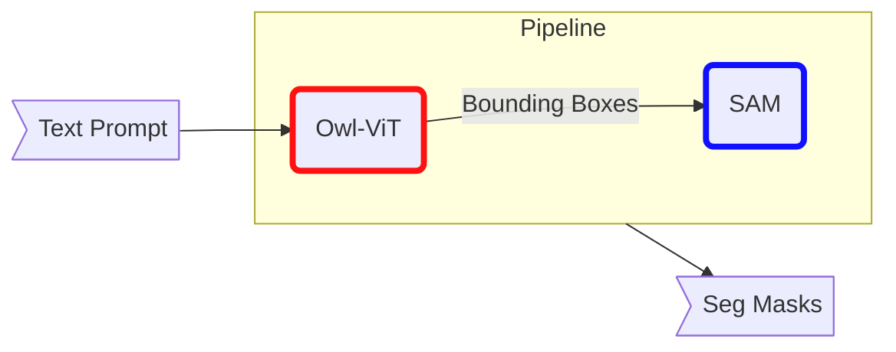
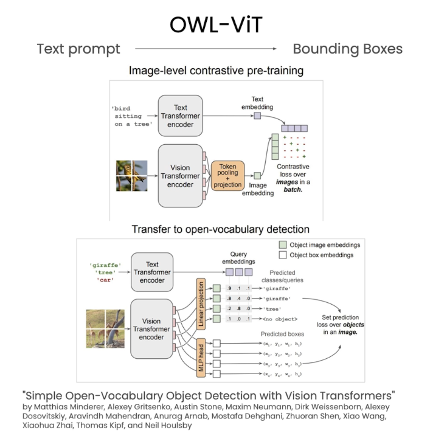

# Lesson3: Object Detection 

## Overview

In this lesson, you'll use natural language to prompt a `zero-shot` object detection model [Owl-ViT](https://huggingface.co/docs/transformers/model_doc/owlvit), where, [ViT](https://huggingface.co/docs/transformers/model_doc/vit) stands for vision Transformer.

You'll then use the output of this model as an input to [SAM](https://segment-anything.com/), which you used in the [last lesson](./L2_image_segmentation_notes.md).

You'll create an `image editing pipeline` by chaining these two vision models (Owl-ViT + SAM), so that a user can give a natural language prompt and the pipeline outputs a segmentation mask

## Image Editing Pipeline

In the last lesson, we saw how to create `masks` based on `point prompts` or `bounding boxes`.

In this lesson, we're going to see how we can use `natural text` to generate these `masks` instead

In order to do this, we're going to be using a `pipeline of models` which means simply that the first the output of the first model will be fed into the second model

> The first model in this pipeline will be a zero-shot object detection model which will then be followed by a SAM model that will take the generated bounding box from this zero-shot object detection model, to generate the masks model, to generate the masks

The zero-shot object detection model we will be using is called `OWL-ViT`.

OWL-ViT model is a zero sharp object detection model, meaning, it can `detect objects` within an image based on simple `text prompts `

> The fact that it is a zero-shot model, means that you don't need to train it in any way for it to detect any object within an image.

The way we will be using OWL-ViT within this lesson, is by using a text prompt, i.e a string of text to generate a bounding box We will not be covering in detail how the OWL-ViT model works but we can cover some of the basics way in which it was trained. 

> **The OWL-ViT model was trained in two parts**: 
> 1. pre-training phase
> 2. fine-tuning phase

**Pre-training phase**

- In the pre-training phase, the model learns to associate an image with a piece of text using a technique that leverages contrastive loss and this process allows the OWL-ViT model to develop a strong understanding of both an image and its corresponding text
  
**Fine-tuning phase**

- In order for this model to achieve good performance, it also required a fine tuning stage
- During this stage, the model is trained specifically for object detection

While in the **pre-training phase**, the model was just learning how to associate a `piece of text and an image`

During the **fine tuning stage**, the model learns to `identify, object and associate them with a particular word or string`

## Lab

Now that we have covered at a high level how the OWL-ViT model works, let's jump into some code and see how we can use it in practice 

Before we start leveraging the two models we will be using in this pipelinegsii Let's start by creating a Comet experiment which will allow us to compare the generated masks that will be produced at the end of this pipeline

We have created here an anonymous experiment, meaning you don't need to create a Comet account to get access to the Comet functionality

Now that we have initialized Comet ML, we can go ahead and create our first experiment, which will be used to track all of the work within this code walkthrough

For this lesson we will be using the same image as we used in the previous lesson

The images of the two dogs sitting side by side.

Let's first load in this image and display it within the notebook so we can remind ourselves what it looks like

In order to view this image we will be using the image function from the PIL library

Instead of downloading the image directly from the internet we will be leveraging Comet artifacts to download all of the images required for this lesson

As you can see, we now have the same image as we used in the previous notebookLet's go ahead and load the OWL-ViT model from the Hugging Face hub

In order to access the OWL-ViT model we will be using the Transformers library and specifically the pipeline method

There are many different versions of the OWL-ViT model available on Hugging Face

For this particular lesson, you will be using the base model OWL-ViT base

Now that the model has been loaded we can go ahead and use it to identify the dogs in the image 

The first thing you will do is specify what you want to identify in the image

In this case, a dog You can then pass the text prompt to the detector model that you have just loaded to generate the bounding boxes of the dogs in the image.

You will be passing here the text prompt as a list for the candidate labels parameter of the detector model as it is possible to pass in multiple text prompts

For example, if you had an image with both a cat and a dog you could pass the text prompt cat and dog to identify both animals in the image

Let's take a look at the output variable

As you can see here, the model has detected two different bounding boxes
for the label dog in two different positions

This is quite promising It means the model has most likely identified the two dogs in the image,

but let's use a couple of util functions to plot the bounding boxes on top of the image that we have seen above

The preprocess outputs function simply takes the output above 
and reformat it to make it easier to plot the bounding boxes 
on the image.

on the image We can then use the show boxes and labels on image function to view the bounding boxes on top of the image of the two dogs

As you can see here, and generate two bounding boxes highlighting each dog on the image the OWL-ViT model has been able to take a text input dog 

It was even able to overlap the bounding boxes of the two dogs, You have now successfully identified the two dogs on the image based on a simple text prompt

You can now move on to the next step of the pipeline, which is to use these bounding boxes to create segmentation masks for each dog

The approach we will be taking is very similar to the previous lesson

However, instead of using the fast SAM model, you will be using the mobile SAM model

As you will have seen in the previous lesson, the SAM model or segment anything model can be used to generate masks based on bounding boxes

The SAM model is quite large and requires a lot of computational resourcef in order to generate these masks this lesson, we will be using the [MobilesAM model](https://arxiv.org/abs/2306.14289), Which has been optimized to run on devices that might not have access to GPUs.

### Model Distillation vs Compression (Quantization)

In order to perform more efficiently the MobileSAM model uses a process known as model `distillation`

> **Model distillation**, allows you to take a very large model and transfer its knowledge to a smaller model and this allows you to run the model a lot more efficiently

> Model Distillation is a different technique compared to model `compression` techniques or `quantization`, in the sense that **it doesn't actually change the model format**, but trains an entirely new and much smaller model

In this lesson, you will see that the MobilesAM model performs just as as well as the larger SAM model

You can now load the MobilesAM model using the Ultra Analytics library

You will now use the SAM model we have just loaded and the bounding box is generated from the OWL-ViT model to generate our first set of segmentation masks for each dog

Similarly to the previous lesson, we wil be defining labels to specify where the bounding box belongs to the object we would like to segment or the background

In our case, all of the bounding boxes belong to the object
we would like to segment, and before the labels will be specified as one instead of zeros.

Given we are implementing a pipeline where the output of the first model is used as an input to the following model, we wil you be using the numpy repeat function to simply generate an array filled with ones where the length of the array is equal to the number of bounding boxes generated by the first model.

We can then use the raw image, the bounding boxes, and the labels to generate segmentation masks using the MobileSAM model

As you can see, we have been able to create segmentation masks in under a second using the highly optimized Mobilesam model.

The model predict function returns a result object that contains not just the masks but also the original image and additional metadata 

We can then extract the masks from this object using the following code.

The masks are simply a series of false and true booleans, which indicate whether a particular pixel belongs to the backoround of the image, or belongs to the mask that we have generated.

In order to visualize the masks you have just created, we can use the show masks on image uti funotion that we have created for you.

As you can see, the MobileSAM model has been able to create two
very accurate masks for both the dog on the right and the dog on the left

You have now successfully used the OWL model to go from a text prompt to a bending box, and the SAM model to go from the bounding box to the generated masks

Putting these two models together means that you now have a pipeline
to go directly from text to a masked image

You can now go one step further and use the generated masks to edit the image 

Let's now try a different use case1231 where we would like to blur out people's faces in an image

You will start by loading in the image to see which faces you have to blur

As you can see, we have an image here with five different people and we will be blurring out each of their faces before using the Owl and MobileSAM model to perform the image editing we will first resize the image to be just 600 pixels wide

This will allow us to perform the entire pipeline in a more time efficient manne

As you can see, the image is very similar1304g0tc 23e18igh resolution image and has simply been downsampled.

This process of resizing images is very useful if you're working with high definition images

Let's use a similar pipeline as we've used for isolating the dogs on the previous image to isolate the faces on this image

The first step will be to define what the text prompt should be

In this case, we will be using the text prompt human face

As we are starting a new model pipeline let's create a new Comet experiment to keep track of all of the different steps of this pipeline
You will start by creating a new experiment and logging the raw image to this experiment

You can now use the OWL mode to create the bounding boxes of the faces in the image

Let's take a quick look at the bounding boxes generated to see if the

OWL model has been able to identify any faces in the image

As you can see here, five diferent bounding boxes have been found by the model

This makes sense as they are indeed five different faces in the image

In order to keep track of each step in the model pipeline let's log the image and the bounding boxes to the command platform.

We Nave created the make bounding boxes annotation util function to make it easier for you to log these bounding boxes to the Comet plätform

You can now use the MobilesAM model with the bounding box prompts as an input to generate the segmentation masks

Now that we have generated the segmentation masks we can go ahead and blur out the faces in the original image

In order to do this, we will start by creating an image that is entirely blurred We will then be using the original image and using the segmentation masks created by the SAM model to replace only parts of the image with the blurred image you will be creating now

You can now use the blurred image you have created to replace just parts of the image

You will start by combining the masks generated py the MobilesAM model
into a single mask that we will then use to replace parts of the image

Now that you have the single mask, you can go ahead and use the mask to replace parts of the image with the blurred outlimage

As you can see the faces have been successfuly blurred out in the image
and you can go ahead and log this to the Comet platform. You hav now successfully used

used the text prompt human face to replace all of the human faces within the image

What if you wanted to blur out not all of the faces within this image but only the faces of the individuals that are not wearing sunglasses?

Let's go ahead and give that a try You can go back to the part of the code where we defined what the candidate label should be, and replace the text prompt human face with a person without sunglasses, for example

Let's go ahead and rerun all of the different parts of the pipeline to see if the model is able to blur out only the faces of the individuals that are not wearing sunglasses

As you can see, the model has generated a single bounding box whereas there are four individuais that are not wearing sunglasses

This might indicate to us that something has not been performing well with this model

Let's continue with the model pipeline and then switch over to the Comet
platform to better understand what is happening By running all of the different steps of the pipeline

You can see that the models have replaced only the sunglasses in the image, rather than what we had originally intended.

As you can see, the model pipeline is not performing as expected

Let's switch over to the Comet platform to better understand where the model is failing

You are now in the Comet platform which you can use even if you do not have a Comet account

Let's start by comparing all of the different images that we have generated side by side

To do this, you can add a new panel Select the image panel

Choose the images you would like to compare

In this case a raw image, the owL image, and the final blurred image

Let's dig into one of the experiments to better understand what is happening

In the original code walkthrough you use the text promot a human face and as you can see the OWL model has successfuly identified all of the difterent faces in the image

As a result, the MobilesAMI model was able to segment at each face and replace it with its blurred version

As you can see here. For the second prompt that you used, a person
without sunglasses the oWl model created a bounding box around the sunglasses rather than around the faces of all of the individuals in the image

As a result, the SAM model then blutred out the sunglasses themselves rather than the faces of the individuals not wearing sunglasses
Comet allows you to visualize a number of images

As you can see here we did not log the image with the bounding box to the Comet platform:

Instead, we logged the image and the bounding box and the Comet platform combines the two for us here. Using Comet you can even turn off the bounding boxes to view the image

When logging data to the Comet platform you do not have to log a static image

Instead, you can log the image and the bounding boxes separately

This allows you in the Comet platform to filter out the bounding boxes based on the confidence score of the model for example. 

You can change here the confidence score from 74.3 to 80

To better see which bounding box the model is very confident in!

And as you can see, the model has different confidence scores depending on the bounding boxes that have beeh generated

You can even turn off the bounding boxes altogether

Now that you have used the model pipelineouple of times why not tweak the text prompt to get the model to blur out the faces of all of the individuals in this image that are not wearing sunglasses?

You can even turn off the bounding boxes altogether 

Now that you have used the model pipeline a couple of times why not tweak the text prompt to get the model to blur out the faces of all of the individuals in this image that are not wearing sunglasses?

Ör maybe even better

Why not try it with one of your own images?

We have also added a couple of images in this notebook for you to try out the techniques you have learned on new images

You could use the image of people in a cafe and provide their faces
Or why not blur out the faces of people walking on the streetior in the metro?

Even better you could provide the faces of the people in this photo

In this lesson, you will have created your first pipeline using the output of one model, the OWL, to serve as an input for the second model, in this case MobileSAM

In the next lesson, you will be looking at how to use `Stable diffusion` to perform `inpainting`

Let's go on to the next lesson.

## References

- Main course: 
  - https://learn.deeplearning.ai/courses/prompt-engineering-for-vision-models/lesson/4/object-detection

Docs: 

- [OWL-ViT - HF](https://huggingface.co/docs/transformers/model_doc/owlvit)

Papers:
- [Owl - ViT (Simple Open-Vocabulary Object Detection with Vision Transformers)](https://arxiv.org/pdf/2205.06230)
- [MOBILE SAM](https://arxiv.org/pdf/2306.14289)
  - [MobileSAM Model](https://huggingface.co/dhkim2810/MobileSAM)
- 

