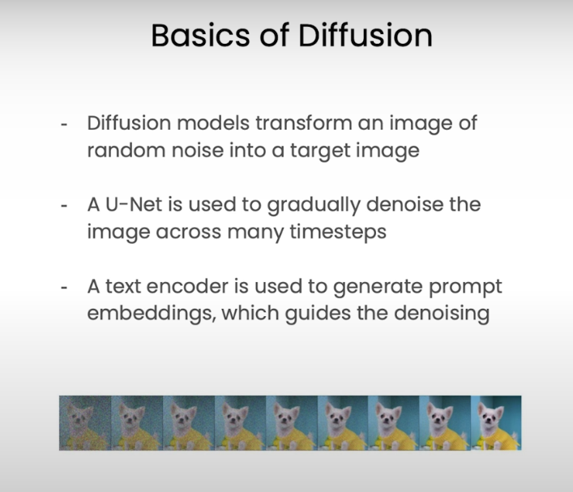

# Lesson4: Image Generation 

## Overview

<!--  -->

You can prompt `stable diffusion` with text, but also with images and masks 

Additionally, you can tune some hyper parameters such as guidance scale, strength and the number of inference steps to better control the diffusion process

Let's generate some images

In previous lessons, you've learned how to use computer 0.17 vision models to extract information from your images in the form of bounding boxes and segmentation masks

And these next lessons, you're going to learn how to use computer vision models to add information to your images using diffusion models

Before we dive in, let's first review a little bit about how diffusion models work under the hood

If you're interested in going deeper

I recommend going through [Deeplearning Al's introduction to Diffusion Models](https://www.deeplearning.ai/short-courses/how-diffusion-models-work/) course

Note that this cour se is not going to get into the mathematics diffusion models

We're aiming to give a high level overview of how they work so that you can do these exercises productively 

Diffusion models, like the one you'll be using in this lesson, are really incredible

They're capable of generating images? do this via a proces which at a super hiah lebelievably detailed images from

And they do this via a process called diffusion which at a super high level, works like this

The model generates an image of pure gaussian noise

Then the model denoise is the image gradually one step at a time

Eventually the model removes enough noise to leave us with an attractive image

In a way, we're kind of lying to the model

We give it an image of pure noise, but we tell it that underneath the noise there's actually an image of a dog

Intuitively, you can think of the model as sort of chiseling the image out of that noise

Mathematicaly, the model is transforming a sample from a simple distribution like gaussian noise, into a complex learned distribution, like images

Our text prompt shifts our target distribution guiding the model towards chiseling out an image that satisfies the prompt

The model that does the actual denoising is alU-Net model and we use a text encoder to generate the prompt embeddings for guiaing our generation

The model you'll be using, however, can take more than just text as a prompt

You can also provide it with images, masks, and various hyperparameters to better control the dittusion process

You can even direct your model to take an ihitial image and use diffusion to edit Especific portion of the image via a technique called

In this lesson, you're going to learn to do exactly that

Let's dive into the first exercise

To motivate this exercise imagine that one of your less computer savvy friends asked you to edit a photo of them

They gave you a photo of them leaning over a cat and asked you to replace the cat with a dragon

You could spend days using Photoshop to edit the image or you could use a diffusion model to do it in minutes.224 To get started we're going to download our masks and images from Comet as artifacts

You've already learned about artifacts previously, but to recap, artifacts are just version controlled assets

They can be anything from models to data sets, or in this case your friend's photo and a segmentation mask of a cat

Once our artifact has been downloaded we can extract the images from them and view them using matplotlib

As you can see, we now have an image of our friend leaning over a cat and we have a segmentation mask of the cat

This is all we need to get started with our diffusion editing process

Before we initialize our model, we want to import Torch and we want to set our device correctly
If we have access to GPUs, we want to use those but if not we can use CPUs for this

Once our device is set, we can initialize a stable diffusion inpainting pipeline from the diffusers library

You should notice that we're using the stable diffusion to inpainting model which is a diffusion model that was trained specifically for these inpainting tasks

We're also using different dimeric formats depending on our hardware situation

This should save some memory

Once our pipeline is initialized, we want to start thinking about the parameters we're going to use to generate our image

The mostimportant and maybe most overlooked parameter is the seed

We want to set our seed number manually so that our results are reproducible later

In addition, we'l need our prompt

We'll need our image

We'll need our mask image

And we'll need a hyperparameter that we haven't discussed yet

In this experiment

But we went ahead and ran this code in another environment and logged the results of a Comet experiment, which we can view now

This image was generated using the exact same code as above

Just run on a system of GPUs so it could run a bit faster

As you can see, we're not quite there yet

We've definitely painted over the cat, but instead of a dragon

we have a frankly terrifying sort of skeletal lizard looking thing 

The first thing we might try in this situation, is simply increasing  the inference steps to a much larger number

Let's say 100

If you look, this is the exact same code as before

We've just changed the inference steps from 3 to 100

As before, we're not going to run this code but we do have another Comet experiment that was run using this exact same code and we can view its outputs right now

Okay

This is looking much better

However, we still have some features that look a fitte oad and I think we could do better

The next thing we might try is tinkering with another hyperparameter called the guidance scale.As: 99%é gtidance scale is a numeric value specifically, we're going to be looking at the number of inference steps

With diffusion pipelines you can control how many inference steps the pipeline takes and de-noising the image

When you allow the pipeline to take more infrared steps there's a more gradual denoising process

Oftentimes, this can lead to a higher quality image

However, there's a point of diminishing returns where you're simply wasting your compute power

You can also end up with an image that looks a little overly processed where the features are a little too smooth or the colors aren't exactly realistic

Returning to our code, let's say ready to generate some images?

First, we'll initialize a new Comet experiment that we can use to log our images, our metadata, and our parameters

Then we'll pass our parameters into our stable diffusion pipeline and generate the output

From there we can extract the image, and then we can log the image the prompt, the seed and the number of inference steps

All to Comet

When we're done, end our experiments and analyze our results

Now we're not going to actually run this code in this environment<5:(0:0bect12 it'll take a while on CPUs. 

that determines how closely the model should follow the prompt

Basically, you can think of it as scaling the effect that the text inputhas on the target distribution during the denoising process

A higher guidance scale means a higher prompt fidelity, but potentially lower image quality

You can see this example here

I gave it a fusion model, a prompt an oil painting of a tabby cat dressed like a character in the Matrix
When the guided skill is set lower, we get an image of a cat

That's a pretty good painting

However, there's not a lot of matrixy things here

When the guidance scale set higher, in this case twice as high we get an image of a cat who has some matrix sunglasses going on but the image of the cat itself is not very good

0ne thing to note about the guidance scale, ie that the default is going to be different for each diffusion model

There's not a standard across the field

So for Stable Diffusion 1.5 which is a smaller model you might use on cpus

7.5 is the default value

For other models it's five 100/ 1th2 models it's one.

For other models it's one And you really just need to check the model specifications to know what's right

Returning to our code what we want to do next is running an experiment where we try several different guidance scale values

To start, we'll make a numpy array of different guidance scale values we'll use in our pipeline

With the guided scale set

We'll run some code that's very similar to the code we wrote previously.

The difference being that this time we're running multiple experiments and that we're passing the guidance scale parameter into our pipeline as wel

Again, we're not going to run this code here. It would take quite a long time to run on CPUs. But we do have another Comet experiment, where we run the same code and log this outputs already

By calling display on our experiment and passing in the tab equals images argument

We're actually able to see the images dashboard of the real Comet application

As you can see here you can see all the image metadata.8:0Z And here, we can see our different outputs

These two images seem to be our best. i Che3t t2e a guidance scale of ten and at 20

So we know that our best output seem to occur when the guidance scale
is somewhere between 10 and 2

We might do a further experiment trying more guidance scale values between 10 and 2 till we find the perfect number.8.28 For now, let's move on to trying a different hyperparameter

The next hyperparameter we're going to look at is one that is unique to image to image applications 8:3Z of diffusion models.8138 This is caled the `Strength Hyperparameter`

When we use a diffusion model to edit an image, as we're doing in inpainting, we have to add a lot of noise to it to delete the section that we want to replace

How much noise we add to it decides how much information gets removed

If we add a little noise, the image will look very similar the way it looked originally. If we add a lot of noise the section we want to replace will be slightly removed

Strength is what determhines how much noise gets added

Let's run an experiment, with strength similar to our guidance scale experiment
where we iterate across a number of possible values.ug: 0r00s /y41 1an see here, the code is largely the same 

As you can see here, the code is largely the same

We're creating a set of possible values for strength

We're iterating across them or passing them all into our stable diffusion
pipeline

For each of our outputs, we log the image and the metadata to Comet
so that we can analyze it later

As before, we're not going to run this experiment here, and we're instead going to view the results of this code via Comet experiment

As we can see when strength is very low, the cat has hardly changed at all

As strength increases more and more of the cat is removed
and unfortunately, changing the strength doesn't seem to have led to a better image for us

That's okay. That's part of the fermentation process

The final input we want to explore adding to our stable diffusion pipeline is the

The negative prompt should be very intuiti

It's simply a prompt that tells the model what you wart the image to not look like

So, because we used a realistic green dragon asAu10d:oove migät give it a negative prompt like cartoon

This should reinforce the realism of our output

Again, you can see that our code is largely unchanged

We're using the best results for previous experiments
setting the guidance scale to ten using 100 inference steps

If we have access to a GPU and we're also passing in this negative prompt

Again, we're not going to run the code here but we've run this code elsewhere and log the output to a Comet experiment which we can view right now

And look at that

Refine our dragon to get rid of some of the features we didn't love in the previous generations

While, enhancing the good qualities With everything you've learhed here and everything we've covered in other lessons

You should be able to build a pipeline where you take an image, generate a mask use inpainting that edit it, and do it all in a streamlined fashion sort of like a stable diffusion powered Photoshop

That's it for this lesson!

In the next lesson, we're going to go one step further with diffusion models And we're going to learn **how to teach'a diffusion model to cenerate an image of something It's never seen before**

## References

- Main course: 
  - https://learn.deeplearning.ai/courses/prompt-engineering-for-vision-models/lesson/3/image-generation

