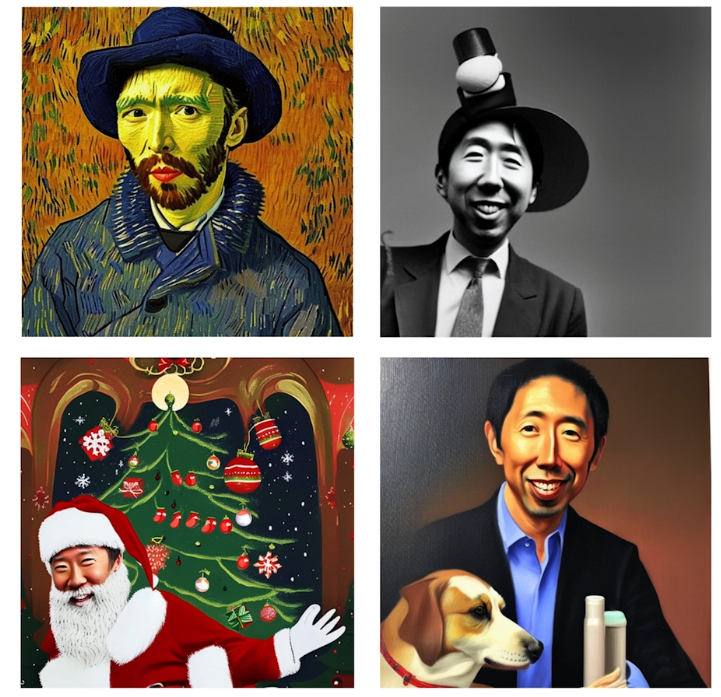
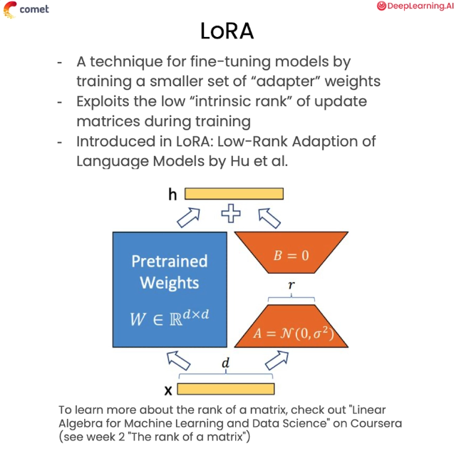
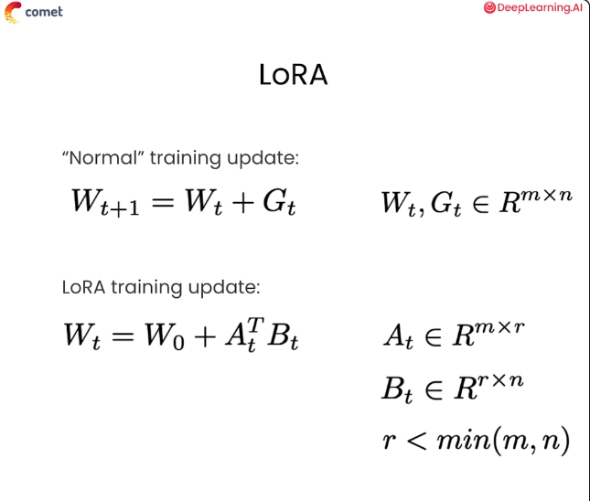

# Lesson5: Fine-Tuning 

## Overview

[Diffusion models](https://huggingface.co/learn/diffusion-course/unit0/1) are powerful tools for image generation but sometimes NO amount of prompt engineering or hyperparameter optimization will yield the results you're looking for.

> When prompt engineering isn't enough, You may opt for fine-tuning instead.

Fine-tuning is extremely resource intensive, but thankfully there's a method of fine-tuning stable ditfusion that uses far fewer resources, called [Dreambooth](https://huggingface.co/docs/diffusers/training/dreambooth)

In this lesson, you'll learn how to fine-tune stable diffusion with just a few images in order to produce your own custom results

### Stable Diffusion Fine-Tuning

Previously, you've seen how manipulating your prompts and parameters can allow you to control the output of diffusion models

Now you're going to explore ways of teaching a model to generate images of a subject it's never seer before

For example how might we teach a model to generate an image of Andrew as a Van Gogh painting?



(Source: [link](https://learn.deeplearning.ai/courses/prompt-engineering-for-vision-models/lesson/6/fine-tuning))

**Fine-Tuning Techniques**

To achieve this, you're going to learn two new techniques for fine-tuning diffusion models

The first technique is called [Dreambooth](https://huggingface.co/docs/diffusers/training/dreambooth)

- DreamBooth is designed to teach diffusior models new subjects using very smell amounts of example data object, for instance, we'l only be using six images of Andrew.
- The second technique is called [Lora (Low Rank Adaptation)](https://huggingface.co/docs/diffusers/training/lora)

We're going to get into more detail with LoRa later but for now, let's start with Dreambooth

### Fine-tuning Challenges

Before we talk about the mathematics behind DreamBooth first think about why it might be difficult to fine-tune a diffusion model with such a small data set

What problems might this cause?

1. The first and most obvious issue has to do with the `robustness` of your data

   - 6 headshots of Andrew might be enough for the model to generate a decent headshot, but it's unlikely that the model is going to be able to generate images of Andrew in other contexts

2. The second issue has to do with `language drift`.

   - When we fine-tune models, we're always walking this tightrope between improving the model's performance on our downstream task and damaging the model's performance on our other tasks

In other words, imagine we aggressively tune the model with our six photos of Andrew, each pair with a prompt like a photo of a man named Andrew

It's very likely that the models embedded definitions of photo and man will begin to drift to match the distribution1.59 of our small, narrow date set that wil then damage the qualty of the model

if we use it later to generate anything besides a photo of Andrew.example, it might think that all men look like Andrew or that every photo needs to have Andrew in the frame

DreamBooth solves both of these problems, in large part
by leveraging the diffusion model's existing understanding of the world

### DreamBooth Basics**

The authors of the [DreamBooth paper](https://arxiv.org/pdf/2208.12242) call this `the semantic prior knowledg`

You can think of this like using context clues when you're reading a new word

When the model sees a prompt like a photo of a man named Andrew it might not know what Andrew looks like but it knows generally what a photo of a man looks like

It can then leverage this information in training, allowing us to get by with a much smaller example dataset

More concretely, this is what DreamBooth looks like in practice

First, you select a token which the model rarely sees, like this bracketed V

Your training loop will overwiite the information in the model associated with this token

This is similar to many other techniques for altering diffusion modeis you mignt run into

You then pair this rare token with another token
that generally describes the class which your subject belongs to

For example, for Andrew, we might select the token pair brackets for man

We then associate prompts which include timages of Andrews.

So for exampie, if we nad an image of Andrew playin associate it with the prompt a photo playing basketball.Basketpall on our dataset,

we might associate it with the prompt a photo of a "[V]" man
playing basketball

The model should be able to use its **prior understanding**
of all the other words in that sentence to guide its generation

So, even if we're not giving the model a super robust dataset because it knows generally what a photo of a man playing basketball should look like

it can hopefully pick up on the specific differences that differentiate the photo of Andrew

playing basketball from a general photo of a man playing basketbal

After fine-tuning, the model should associate the token
pair "[V]man" specifically with Andrew

Now, this might solve the issue of having a small dataset but it does not solve the language drift issue we discussed earlier

In fact, based on everything we describe so far, it might seem to you like we're almost certainly going to destroy the model's definition of man in the training process

DreamBooth addresses this problem in a really clever way

### Prior Preservation Loss

The authors of the paper created a custom `loss metric`, which they call a **prior preservation loss**, which implements an interesting form of `regularization`

Prior Preservation penalizes the model for drifuing too far from its existing understanding of the world

Generally speaking, it works like this:

```
You create a data set of images paired with prompt

In this case you might have six photos of Andrew with captions like "a photo of a [V] man'"

In DreamBooth parlance, we call these the `instance images` and `instance prompt`
```

In this project, you're going to use a single prompt for every single one of your images, but you should experiment with writing custom prompts for each image

You can even use a model like [BLIP](https://huggingface.co/docs/transformers/model_doc/blip) to automatidally generate the captions for your images which is really useful when you're working with a larger number of images

You then select a prompt that is representative of al the concepts you're afraid your model was going to lose during fine-tuning and the DreamBooth literature we call this the class prompt

For example, if your instance promptis "a photo of a IVI man" your class prompt would simply be a photo of a man

Using the class prompt, you generate 100 to 200 images from the diffusion pipeline

With these images, you can construct a robust distribution representing the model's prior understanding of these prompt concepts.

During the training process, you then calculate two losses

- First, you calculate the loss against the instance data

Basically, how good is the model at reconstructing these images of Andrew when we give it our modified token pair

- Second, you calculate the loss for the class data

In other words, how close does the model come to generating an image from the prior distribution when prompted with the class prompt?

Because the class distribution is sampled directly from the model before you conduct any fine-tuning, it gives you a concrete basis for measuring how far the model has drifted

Basically, if given the same prompt, the model generates a wildly different image before and after fine-tuning we know that there's been some drift

> You can then combine these two terms which we'll call the `instance loss` and `the class loss` to give you a comprehensive loss metric

## Lab

Now that we're familiar with DreamBooth from a theoretical perspective

Let's try actually implementing

Much of the code you'l be using throughoul this section is adapted from Hugging Faces preamBooth training scripts,

the model doesn't drift during a training process we can increase this to a higher value

Next, we want to initialize a Comet experiment that we can use throughout the project

Before you can start training your model you're going to need to generate your class images.8:2Z We're going to write the code for generating your class images

We're not actually going to run it because we're doing it on a CPU can take quite a bit of time

Instead, we've provided the entire dataset of class images as a Comet artifact that we can just download immediately

As a refresher, a Comet artifact is an asset that's stored in comet and version controlled

The easiest way to generate your class images is to use this DreamBooth trainer or utility class we provided

We're going to use this a lot throughout this project

To abstract away some of the boilerplate you'll need to run your training pipelinea.

Now, if at any time you get curious ahout what's actually going on under the hood with these utility methods, you can always use the double question which you can find link to the bottom of this notebook

You're encouraged to explore these examples to learn about all the complex optimizations that are available here

In this example, we've done everything we can to simplify this code to highlight the high level concepts

You'll also be using Comet to log your training metrics throughout this exercise

Comet automatically integrates with many of the libraries
you'll be using throughout this project

So, it's really important$:27 that we import and initialize Comet before we import any other libraries

Most of our focus throughout this project is going to be on the hyperparameters and how we can tune them to control the outputs of our diffusion model

We'll be storing our hyperparameter in a simple dictionary that we can update throughout the lesson

Most of these terms should be fami liar to you already,but there's a couple things we want to cal out here

First, you should notice that we're importing a different model depending on whether or not you have access to a GPU.

If you have a GPU, we're going to use Stable Diffusion XL.

This is one of the larger stable diffusion models and has really high quality images

If you're running on a CPU, we're going to use stable diffusion version 1.5, which is an earlier model that can still generate high quality images

It's just not quite as powerful

We have our instance prompt in our class prompt.

We also have a manual seed that we're setting to make sure that our results are reproducible.

You can see here that we set the resolution to 1024 pixels if we have a GPU, and if not, we set it to 512.

This is because different stable diffusion models do better at different sizes

Additionally, we're going to set our number of inference steps to be 50

Our guidance scale to be 5.0

We're going to by default generate 200 class images.

And we're going to set the prior loss weight to 1.0.

The prior loss weight is a numeric value that scales our class loss when we're calculating our prior preservation loss

If all we care about is making sure our modellearns our new concept
we can set this to zero.

If we're really concerned with making sure mark operator to look inside the source code

To download our class data set from Comet

We're going to make use of the experiment we initialized earlier

Once that data set has been downloaded, we can take a peek at it by using the display images method on our trainer

As you can see, `stable diffusion 1.5` does a decent job of generating images of men

Although it seems to have a theme for black and white photos and mustaches

Next, we need to download our instance data set, which consists
of images of Andrew.

We have that saved as a Comet artifact as well We can download it using very similar code

Once it's downloaded, we can take a peek inside it using the same display images method we used earlier

There are two really important things to note when looking at this dataset One. 

Notice that the images are of different sizes and a different quality

This isn't a dataset that we did a lot of preprocessing on

This illustrates that with DreamBooth, you can tune a model really effectively using data thatis readily available to you

The second imbortant thing to notice is that Andrew owns a lot of blue shirts

Now that our data sets are downloaded1111089°/8089move on to initializing our models.

If you recall, a diffusion pipeline consists of a text encoder model a variational autoencoder and a [U-Net model](https://huggingface.co/docs/diffusers/api/loaders/unet) that is used for the actual denoising process

We can initialize all of these along with our tokenizer by using the trainer.initialize models method

Adding random noise to our images at different time steps is an essential part of the diffusion process

Because of this, we're going to need a noise scheduler to generate our noise

[Hugging Face's diffusers library](https://huggingface.co/docs/diffusers/index) provides a lot of really nice abstractions
for accessing these kinds of schedulers

Now, we're almost ready to begin training our mode

But first, we need to talk about LoRA the technique we'll be using to actually fine-tune the model



One of the key challenges behind fine-tuning large models is that weight matrices are at the risk of sounding obvious, really large

If your weight matrix is of size MxN, then you may need to compute a gradient matrix that's also of size MxN for every single update

With many optimizers such as Adam with momentum

You actually compute multiple such matrices leading to a very large memory footprint

However, the update matrix that you generate<112900a67Rg9he fine-tuning process also tends to be really low rank.

That means that the rank of the matrix, or the number of linearly independent columns, tends to be much smaller than the actual number of columns in the matrix

Intuitively this tells us that we can probably capture a lot of the important information for updating our weights in smaller matrices

This is essentially what LoRA does.

Instead of computing a full MxN update matrix to update our weights at every single step of the training process, LoRA instead trains a new set of smaller weights, which we call adapters which are then added to the original weights

Mathematicaly, this is what LoRA looks like: 



In a normal training update, the weights at the next timestep look like the weights at the current time step, plus an update matrix where the weights and the update matrix are both matrices of size MxN.

In LoRA the weights at timestep T are equal to the original weights plus the product of two matrices A and B, taken at timestep T

Now matrix A is an NxR matrix, while matrix B

RxN matrix and R is less than the smaller of M8amp;N

Essentially, we take two smaller matrices and we train them instead of training the original weiahts

These smaller weights can then_11 62983d to the initial weights to achieve the effect of fine-tuning.

Besides the reduced memory footprint, one of the nice parts of LoRA is that you can have many different sets of LoRA adapters that you can switch in and out easily

So, for instance, if you later wanted to fine-tune a LoRA adapter for a photo of a different person you could swap them out for your Andrew adapters very easily

In this example, we're only going to be tuning the U-Net model, so it's the only model we need to prepare for [LoRA](https://huggingface.co/docs/diffusers/training/lora)

In addition, we also need to initialize our optimizer and extract the parameters
we're going to be optimizing

Finally, we need to ihitialize our training data set our training data loader and our learning rate scheduler

We'll then load all our relevant models along with our data sets and to Accelerator, Which is a Hugging Face library that allows us to train more efficiently

Now let's get into our actual training loop

First, we need to calculate our total batch size

We're going to use gradient accumulation in this pipeline

This is a technique where we only update the weights every few steps

Because of this, we need to set our total batch size<11
d 30-02r number of gradient accumulation steps times our single step batch size.

Now for the training loop itself

First, we want to set up the progress bar for tracking our training

The diffusion process has a few steps.14:5Z First, we want to convert our image into its latent representation

To do this, we pass the pixel representation of our image into our variational auto encoder

Then, we sample from the latent distribution.15:0g Once we've converted our image into its latent representation we then need to sample the noise that we're going to add to the latents
as we train

Finally, to complete the forward diffusion process we need to add our noise to random timesteps

Now that the forward diffusion process is done, we need to perform reverse diffusion

To do this, we need to get the embeddings of our prompt and use the U-Net model to predict the noise in the image

Once we have our prediction we can calculate our prior ioss and our instande loss15:4g and add them with the prior loss weight to calculate the prior preservation loss

Once our loss have been calculated, we can perform backpropagation and step our optimizer as you would in any other training loop.<115000Nc the end of each epoch, we want to log our loss metrics to Comet. 

At the end of our training we want to save our LoRA weights, log our parameters to Comet
and add a little tag so that we remember that this was a DreamBooth training project

Then, we can call end training on our accelerator and we're done

Again, we're not going to actually run this training code in this environment because on CPUs, this will take quite a long time

However, we do have an existing Comet experiment taken from a training run of this exact same model, which we can use to analyze the results

We can call display on this experiment and see the metrics that it logged to Comet

Now we can edit the layout to get a better look at our most important metrics

In particular, we want to see how the loss the prior loss and the instant loss all compare

Throughout this course, we've emphasized the importance of getting hands on with your image data
and visually inspecting your model's output

This project really drives this point home because if we look at these loss metrics
you'll notice some really interesting data

First, you can see that the loss seems to overcorrect back<川17: 1h between the prior loss and the instance loss.

The peaks in the prior loss tend to correspond to valleys in the instance loss, and vice versa

This kind of seesaw effect might make you think that the prior preservation loss metric didn't really work, as the model doesn't seem to converge

However, if we look at the outputs of the model, well see a very different story

To illustrate this we're going to use our model to generate a bunch of different images of Andrew17.:34 and a bunch of images that dont inciude Andrew

To start, let's set up some prompts and some validation prompts

You can see we have several prompts that are targeted at generating an image of a man wno looks like Andrew

And then we have several equivalent prompts that remove the "[V]"
token

Once we have our prompts in place we want to create a aiffusion pibe line out of the model we just finished training

If you look, we initialize a pre-trained diffusion pipeline using the stable diffusion 1.5 model

Then we load our LoRA weights onto that model

With our pipeline, we iterate over each prompt generate an image, and logging it to comet

Again, we're not going to run this code here<1 1 it will take some time on CpUs.

But we've already run this on Comet, and we've stored the results in an experiment that we can visualize below.

We can load our existing experiment like this, and then we can view the images that are logged by passing the tabs equals images argument to the experiment. display method

This is what the actual images tab in the Comet dashboard will look like.

In it we can see the images that were logged by the pipeline.

If we click on one of them, we can see that this was one of our validation

prompts as there's no '[V]" token here

Looking at the image, it makes sense.

It looks like a normal man.

If you find its equivalent instance prompt, however we see thet when we add the Iyi man!
the mural that is generated looks a lot like Anarew

Similarly, this image of a "[V] man' blaying basketball looks ia lot like Andrew.


Whereas this image of a man playing basketball doesn't look like Andrew at all.
19:2Z Even though the loss curves wouldn't tell us that our model had improved by looking at the outputs, we can see that it cleanly is learning.
<11

T/20k03 for us is that we visually inspect the outputs of our model, no matter what the loss curve is saying.

Oftentimes, we'll be surprised by the results.

That brings us to the end of this lesson

You're encouraged to take things a step further and try experimenting with some other hyperparameters.

You can also try to tune a larger, stable diffusion model using a GPU environment like Google Colab.

You can even collect the data set yourself or try targeting a different token.

Using the code provided here, you should be able to take on a diverse array of projects.

## References

Main course: 
- https://learn.deeplearning.ai/courses/prompt-engineering-for-vision-models/lesson/3/fine-tuning


Resources:
- [Awesome-Diffusion-Models: A collection of resources and papers on Diffusion Models](https://github.com/diff-usion/Awesome-Diffusion-Models)


Docs: 

- Fine-tuning Techniques:
  - https://huggingface.co/docs/diffusers/training/dreambooth
  - https://huggingface.co/docs/diffusers/training/lora

Models
- [BLIP HF](https://huggingface.co/docs/transformers/model_doc/blip)
  - Tasks: 
    - Visual Question Answering
    - Image-Text retrieval (Image-text matching)
    - Image Captioning
- [U-Net HF](https://huggingface.co/docs/diffusers/api/loaders/unet)

Papers: 
- [DreamBooth Paper](https://arxiv.org/pdf/2208.12242)


